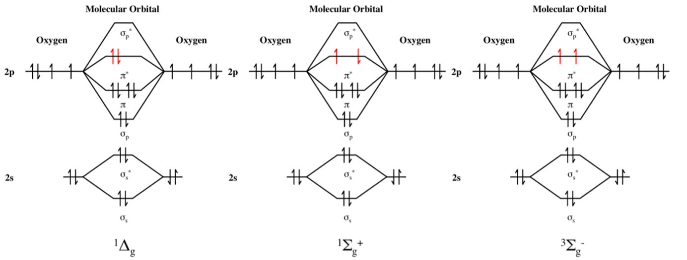
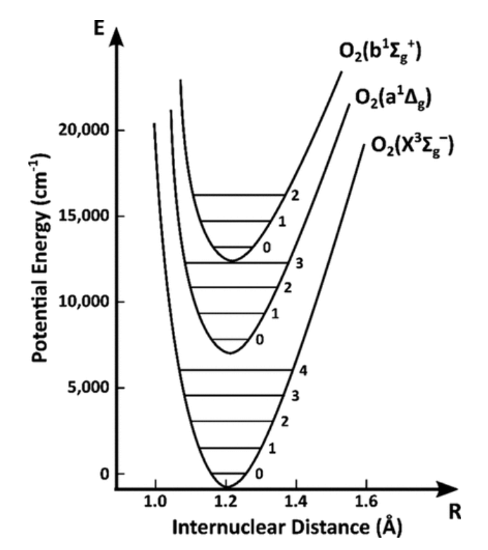
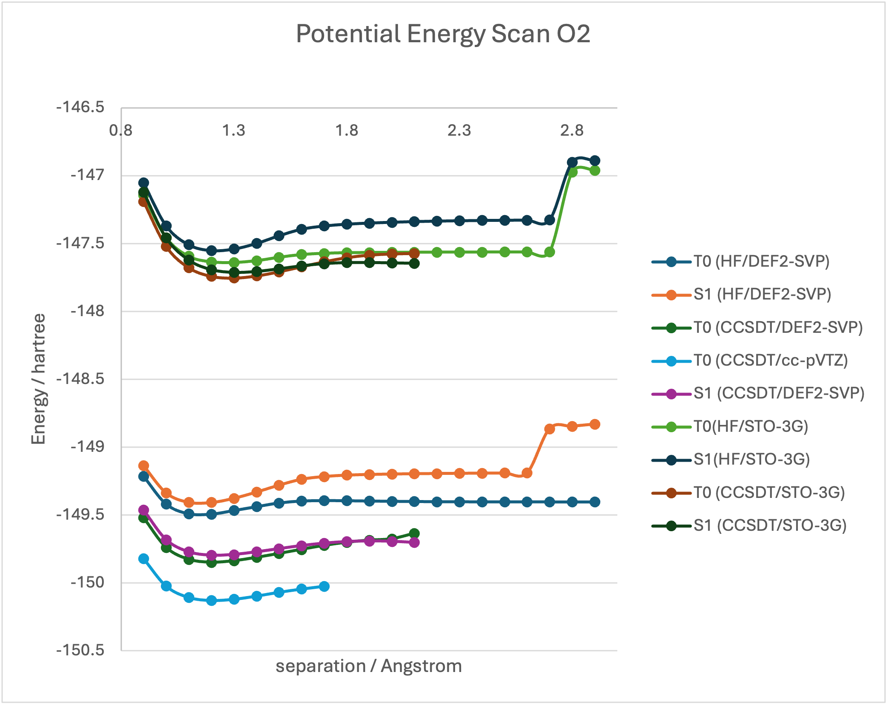

# nqcc-hackathon-2025
Code for OpenBioSim's use case for the NQCC 2025 Hackathon

This repository contains a Pennylane script to compute the energies of the ground state and the first excited state of molecular oxygen using variational quantum algorithms. 

# Installation instructions

We encourage you to run your code inside the Google Colab environment that will be provided for you. If you wanted to run the notebooks on your laptop, you can follow the instructions below, that have been tested on Linux/Ubunu 20.04.6 LTS.

```
mamba create -n hackathon python==3.12
mamba activate hackhaton
pip install custatevec_cu12 pennylane-lightning-gpu pennylane-catalyst jax==0.4.28 jaxlib==0.4.28 jax-cuda12-plugin==0.4.28 optax notebook matplotlib jax[cuda12_pip]==0.4.28 -f https://storage.googleapis.com/jax-releases/jax_cuda_releases.html
pip install openfermionpyscf
git clone https://github.com/OpenBioSim/nqcc-hackathon-2025
cd nqcc-hackathon-2025/
jupyter-notebook VQD-O2-hackathon.ipynb
```


# Scientific Background

Quantum computers offer the potential to achieve highly accurate models of the electronic structure of molecules, addressing the challenges posed by the steep computational cost of post-Hartree–Fock wavefunction methods. However, in the current era of noisy intermediate-scale quantum (NISQ) hardware, it is essential to carefully optimize quantum circuits to minimize the number of gate operations, enabling reliable execution on existing devices.

In this hackathon, you will take on the challenge of computing the energies of the ground state and low-lying excited states of molecular dioxygen (O₂) using quantum algorithms. O2 is the second most abundant molecule in Earth’s atmosphere. In its electronic ground state, O₂ exists as a triplet state, meaning two electrons are unpaired. Photon absorption in the UV–vis spectrum can excite O₂ into two distinct reactive singlet states. These singlet states are short-lived and highly reactive, playing crucial roles in atmospheric chemistry, healthcare technologies (e.g., photodynamic cancer therapies), and materials science (e.g., battery corrosion).


**Figure 1.** MO diagrams for O2 in its ground state and first two-excited states -source Wikipedia-

We can predict the optimal wavelength of a photon required to excite O₂ from its electronic ground state to an excited state by computing vertical excitation energies—the energy differences between the ground and excited states at the same nuclear geometry. These energies are obtained by solving the time-independent Schrödinger equation for each state at a fixed geometry. At room temperature, O₂ in its ground state predominantly occupies geometries near its equilibrium bond length. Therefore, calculating vertical excitation energies at this equilibrium geometry provides a good estimate of the energy gap between the ground and excited states.



**Figure 2.** Schematic potential energy surfaces for three electronic states of O2, the ground state T0, the first excited state S1, the second excited state S2. -source Wikipedia-

We can gain deeper insights into the properties of O₂ by computing the energies of different electronic states as a function of bond length. As the O₂ bond is stretched, its electronic structure becomes increasingly multireference in character, and classical electronic structure methods like CCSD(T) begin to struggle with wavefunction convergence.
Below, you can see potential energy surface plots for various O₂ states, generated using different classical computational chemistry methods. These calculations were performed using the ORCA 6 software package. The Hartree–Fock solutions are poor, exhibiting significant spin contamination as the geometry deviates from the equilibrium bond length. The CCSD(T) calculations were carried out until the SCF solver failed to converge. As the basis set becomes more complex (from STO-3G to def2-SVP to cc-pVTZ), the computed potential energy values decrease, in accordance with the variational principle. The raw data is available in the GitHub repository, should you wish to replot any of the results alongside those from the variational quantum algorithms (VQAs).


**Figure 3.** Classical benchmarks for computing potential energy surfaces of O2 in its ground state T0 or first excited state S1. 

From these plots we have estimated the following vertical excitation energy between the ground state and the first singlet state. They are given in electron volts (eV) for consistency with the spectroscopy literature (1 Hartree = 27.2114 eV).

## Table 1. Vertical excitation energies for the T0->S1 transition. 

| Method    | Excitation energy / eV |
| -------- | ------- |
| Experiment  | 0.980  |
| HF/STO-3G   | 2.278  |
| HF/DEF2-SVP | 2.321  |
| CCSD(T)/STO-3G | 1.334  |
| CCSD(T)/DEF2-SVP | 1.401  |
| CCSD(T)/cc-pVTZ | 1.360 |

The provided PennyLane notebook implements Variational Quantum Eigensolver (VQE) and Variational Quantum Deflation (VQD) to optimize the energies of O₂ in its ground state and first excited state, using a small active space and a minimal basis set. With the default settings, it yields a vertical excitation energy of 1.467 eV, which is slightly less accurate than the results from CCSD(T) calculations.

# Hardware Architecture

For this hackathon, you will be using Alice & Bob emulators. These emulators reproduce the behavior of quantum computers based on cat qubits, superconducting qubits that are naturally protected against one type of noise (bit-flip errors).

## About cat qubits

You can get a broad overview of how cat qubits work in the third part of our [whitepaper](https://alice-bob.com/wp-content/uploads/2024/12/Think-Inside-The-Box-Alice-Bob-Whitepaper.pdf), and you can play with the interesting properties of these qubits in the following [tutorial](https://github.com/Alice-Bob-SW/felis/blob/main/samples/An%20introduction%20to%20cat%20qubits.ipynb) (note that going from physical qubits to logical qubits by explicitly implementing quantum error correction is outside the scope of this hackathon).

For a deeper dive, a selection of relevant scientific articles is available at https://felis.alice-bob.com/docs/reference/papers/.

## About Alice & Bob emulators

Alice & Bob's Felis library lets you use cat qubits emulator under the form of Qiskit backends reproducing the gate set and noise model of quantum computers based on cat qubits: https://github.com/Alice-Bob-SW/qiskit-alice-bob-provider. Note that we provide a Pennylane connector so that you don't necessarily need to work with Qiskit.

Two types of emulators are available: "physical" and "logical". As the "physical" emulators are focused on running error correction experiments and do not feature a universal gate set, make sure you use "logical" emulators, which behave as an error-corrected (but not error-free) quantum computer would. For more about the distinction, you may read https://felis.alice-bob.com/docs/backends/logical_physical/.

"Logical" emulators have two important features that will require you to adapt your algorithms:
- They feature a discrete gate set, meaning your circuits must first be transpiled to this gate set in order to run. To test this feature in isolation, you may use the `EMU:40Q:LOGICAL_NOISELESS` backend (https://felis.alice-bob.com/docs/backends/backends_list/logical_noiseless/), which does not have a noise model and should therefore return the same results as your favorite generic emulator.
- They feature a noise model, meaning your results will feature errors. This model depends on several parameters: `distance`, `kappa_1`, `kappa_2` and `average_nb_photons`. You can read more about these parameters at https://felis.alice-bob.com/docs/backends/set_parameters/. Backends such as `EMU:15Q:LOGICAL_EARLY` (https://felis.alice-bob.com/docs/backends/backends_list/logical_early/) have preset values for these parameters, but you can override the preset values by specifying your desired value upon backend creation.


# Hackathon challenge! Can you complete as many as possible of the objectives below?


## Tutorial mode

Can you execute the provided notebook and obtain a similar vertical excitation energy mentioned below (ca. 1.467 ev)?  See also tutorial #1 for additional insights in VQE and VQD. 

**Google cloud: Can you provide instructions/starting points to execute the provided Pennylane notebook on a Google colab.**

## Scientific Objectives

These objectives assess how well the quantum simulations reproduce experimental data—a key step in validating more complex future simulations of O₂.

•	S1) Can you optimize the algorithm to compute a vertical excitation energy for the first excited state that agrees within 0.1–0.2 eV of the experimental value?

•	S2) Can you compute an accurate vertical excitation energy for the second excited state? Experimental data shows that the S₂ singlet lies 1.627 eV above the T₀ ground state.

•	S3) Can you compute an accurate bond dissociation energy for O₂ in its T₀ ground state? This can be determined by measuring the difference in potential energy between O₂ at its equilibrium bond length and at a large separation of the two oxygen atoms, where no chemical bonding occurs.

•	Bonus – S4) Can you compute potential energy scans for O₂ in the S₁ and S₂ states and recover the energy values of dissociated O₂ in its ground state? From this, you can also estimate adiabatic excitation energies and compare them to vertical excitation energies.

These objectives can be pursued using algorithms that may offer limited accuracy. However, it is preferable to optimize and deploy algorithms that demonstrate competitive performance with classical quantum chemistry methods.

## Technical Objectives

These objectives assess how well you can adapt your work to some of the constraints introduced by error-corrected quantum hardware. Read above for an introduction to Alice & Bob's hardware and emulators.

•	T1) Can you modify the provided code to deploy variational quantum algorithms on Alice and Bob emulators? Can you optimize algorithmic choices to reduce the size of transpiled circuits and improve speed, without compromising accuracy?

Tips:

- While the emulators are Qiskit backends, Pennylane has a Qiskit connector that you can use. See https://github.com/amoutenet/pennylane-alice-bob for a sample implementation.
- Transpiling will be an issue, as targeting the gate set of logical qubits requires knowing the exact value of the parametrized gates typically used in variational circuits. You may need to change your algorithm's behavior so it transpiles right before running the circuit. This will likely affect your algorithm's speed (both because transpilation needs to be done several times, and because circuits will be deeper).

•	T2) Compare the results of the VQAs run via noiseless emulation to those obtained on noisy backends. Can you develop error mitigation strategies to reduce the impact of noise on computational accuracy?

Tips:

- To compare noisy against noiseless results, you may draw inspiration from the following notebook: https://github.com/Alice-Bob-SW/felis/blob/main/samples/2_algorithms/4%20-%20Benchmarking%20a%20logical%20cat%20qubit%20processor%20through%20the%20SWAP%20test.ipynb. It shows how to explore the parameter space of the noise model and plot the results to identify acceptable combinations. Note that real hardware will have a fixed $\kappa_1/\kappa_2$ value, flexible `average_nb_photons` and might have some control over `distance`. It can be interesting to identify a $\kappa_1/\kappa_2$ value giving mixed results and identify what distance and number of photons should be used, knowing that a larger distance means more qubits on the chip.

•	Bonus – T3) From NISQ to FTQC: Variational algorithms were first developed to take advantage of NISQ machines. Based on your above experiments, can you understand why, and what kind of limitations they face? A typical fault-tolerant algorithm to determine eigenvalues is the Quantum Phase Estimation (QPE). Can you use such a method, rather than VQE, to reproduce or even outperform some of the scientific objectives above?

Tips:

- If the resulting circuit is too large to be emulated, you may explore the Alice & Bob resource estimator at https://github.com/Alice-Bob-SW/qsharp-alice-bob-resource-estimator

## Hints / Suggestions

•	Break the work into independent tasks that can be pursued individually and consolidated later. For example: scientific accuracy, hardware deployment, and circuit optimization.

•	Be cautious of spin contamination. The ⟨S²⟩ expectation value of the optimized states can help confirm whether you have converged to a triplet or singlet state.

•	To improve accuracy, consider:
i) Increasing the active space size
ii) Using a larger basis set
Larger active spaces that include more virtual orbitals are expected to yield more accurate results but may quickly exceed the capabilities of emulators or quantum hardware. You might try using a differential Hartree–Fock solver to optimize orbital coefficients, allowing for more accurate results with a smaller basis set. See Tutorial #5 for guidance.

•	To reduce qubit counts or circuit size, consider Hamiltonian optimizations such as exploiting Z₂ symmetries. See Tutorial #4 for examples. Additional Hamiltonian compression methods are discussed in Tutorial #3.

•	To compute the second excited state, you can extend the VQD code by adding another orthogonality constraint to the loss function. You may also be able to reduce circuit complexity by replacing the standard SWAP test with a destructive SWAP test. Alternatively, consider implementing a different algorithm, such as FoldedVQE.

•	As the O₂ bond is stretched, the Hartree–Fock initial state may exhibit poor overlap with the true wavefunction. In such cases, alternative classical state preparation methods (e.g., CCSD) may provide a better starting point. See Tutorial #2 for inspiration.

# Relevant Pennylane tutorials 

1)	https://pennylane.ai/qml/demos/tutorial_vqe_vqd
2)	https://pennylane.ai/qml/demos/tutorial_initial_state_preparation
3)	https://pennylane.ai/qml/demos/tutorial_how_to_build_compressed_double_factorized_hamiltonians
4)	https://pennylane.ai/qml/demos/tutorial_qubit_tapering
5)	https://pennylane.ai/qml/demos/tutorial_differentiable_HF

# Relevant references

Higgott, Oscar and Wang, Daochen and Brierley, Stephen “Variational Quantum Computation of Excited States” Quantum 3, 156 (2019)

Folded Spectrum VQE: A Quantum Computing Method for the Calculation of Molecular Excited States Lila Cadi Tazi and Alex J. W. Thom Journal of Chemical Theory and Computation 2024 20 (6), 2491-2504 DOI: 10.1021/acs.jctc.3c01378


Happy hacking !!